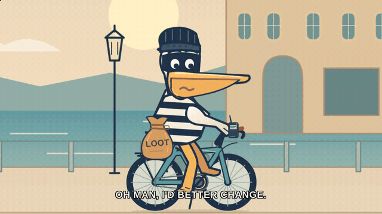
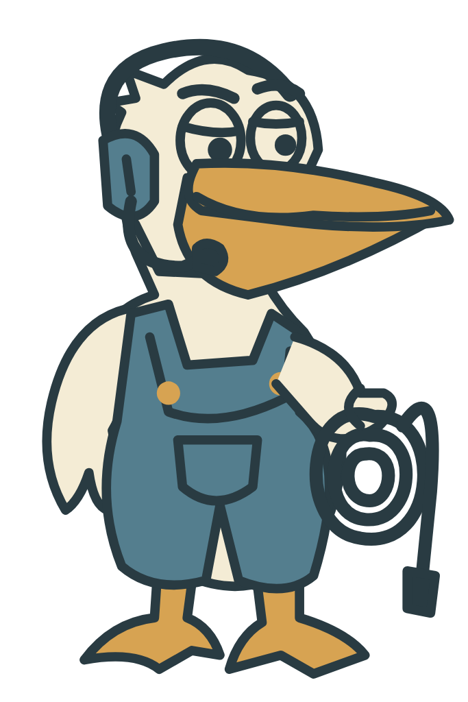
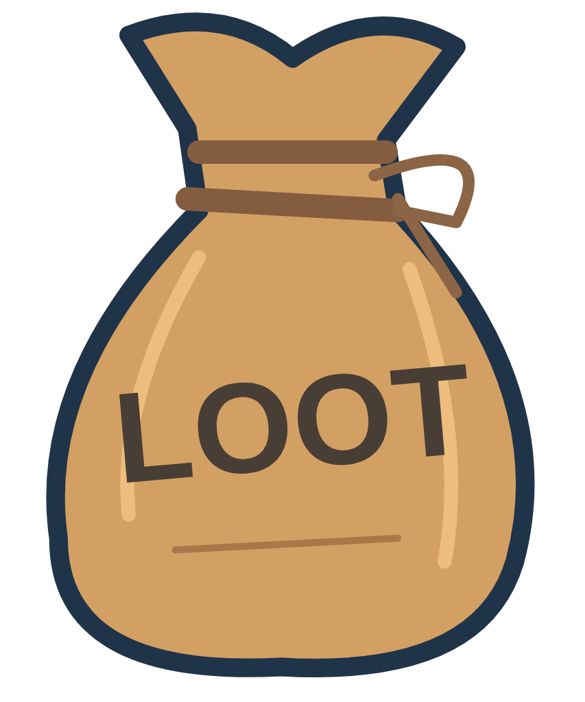
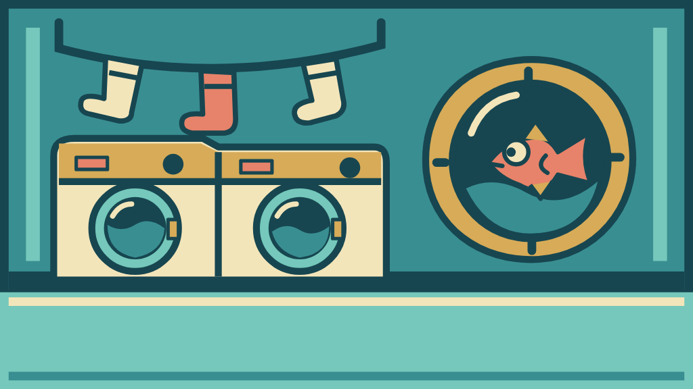
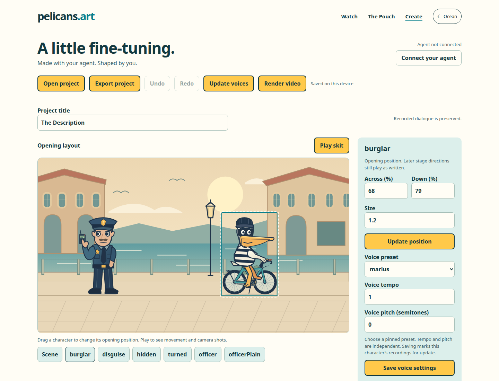

# pelicans.art

An agent-first SVG theater and companion editor for making odd little voiced comedy skits.

[](https://pelicans.art/watch/the-description-f8ccb1/)

**[▶ Watch The Description with sound · 39 seconds](https://pelicans.art/watch/the-description-f8ccb1/)** · [Copy the agent prompt](#create-with-your-agent-recommended)

The project grew out of [Simon Willison's pelican-on-a-bicycle LLM test](https://simonwillison.net/2024/Oct/25/pelicans-on-a-bicycle/): if a model can draw a recognizable SVG pelican riding a bicycle, what happens when generated SVG characters become reusable, expressive actors?

## Choose your entrance

| You want to… | Start here | Setup |
| --- | --- | --- |
| Watch a finished skit | [The Description](https://pelicans.art/watch/the-description/) | None |
| Create through an agent chat | [Agent workflow](docs/AGENT-WORKFLOW.md) and [portable skill](skills/pelican-theater/SKILL.md) | Local rendering and speech; no additional LLM API key |
| Edit visually or remix | [Editor](https://pelicans.art/editor.html) | None; open an agent-created project |
| Develop, capture, or use custom voices | [Run locally](docs/LOCAL-SETUP.md) | Node.js and optional media tools |

Start with an agent that can edit files and run shell commands. It writes artwork and dialogue directly, then uses the CLI to synthesize local speech and render an MP4. No additional LLM API key is needed. The companion Editor provides visual changes, optional private Hermes chat, voice updates, and MP4 rendering through your local server; watching needs no setup.

The repository is public. Agents can fetch `https://github.com/SamPatt/pelicans-art.git` over HTTPS without GitHub credentials, tokens, or a deploy key. The downloadable skill pins a tested runtime revision.

## Draw a cast. Give it a problem.

| A tired pelican stagehand | A mushroom chef with opinions | A health inspector who has seen enough |
| :---: | :---: | :---: |
|  |  |  |

**Props**

| Police scanner | A suspiciously labeled sack |
| :---: | :---: |
|  |  |

**Backgrounds**

| Underwater laundromat | A very ordinary office on the moon |
| :---: | :---: |
|  |  |

[Browse more characters, props, and backgrounds in the Pouch →](https://pelicans.art/community.html)

## What works

- Generate and edit SVG characters, props, and backgrounds.
- Animate faces, eye direction, movement, camera shots, and prop interactions.
- Build sequential skits from a constrained JSON action format.
- Generate or attach voices and synchronize them with captions and mouth movement.
- Store browser projects locally in IndexedDB and export portable backups.
- Run a private local authoring server for filesystem assets and custom voice processing.
- Export published skits as self-contained JSON bundles.
- Capture complete skits as H.264/AAC MP4 videos with PNG artwork.

The deliberately simple visual style is part early web animation, part AI artifact. The goal is not photorealism; it is to make model-generated characters directable and funny.

## Create with your agent (recommended)

Copy the block below into an agent chat that can run shell commands. Your agent downloads the skill and sets up the runtime, then works out the skit with you in chat before creating the video.

```text
Download https://pelicans.art/downloads/pelican-theater-1.0.15.zip and its release receipt https://pelicans.art/downloads/pelican-theater-1.0.15.json into a new temporary directory. Verify the ZIP's SHA-256 against the receipt, extract it, and read pelican-theater/SKILL.md and its required references. Follow the skill in this conversation; handle fetching the runtime and setup yourself, without asking me to clone the repository first.

Use the tested runtime commit in the receipt's ref field. Fetch the public runtime from https://github.com/SamPatt/pelicans-art.git over HTTPS; no GitHub login, token, SSH alias, or deploy key is needed. If fetching fails, explain the network or environment problem. Do not request tokens, change Git authentication, or change repository visibility.

Before making the first skit, ask whether I have an idea or would like two absurd suggestions. Confirm portrait (9:16) or landscape (16:9) if I have not specified it. Then walk me through your proposed characters and their appearances and voices, setting, scene beats, and exact dialogue in this chat. Suggest sensible defaults for length and tone. Revise the plan from my feedback and wait until I approve it before generating finished artwork, speech, or video. No storyboard editor or separate file is needed.

Once I approve the plan, create the skit by writing the SVG artwork and script directly with your current model, without OpenRouter. Use local Pocket TTS or verify an existing compatible speech service, keeping any new dependencies isolated. Preserve the agreed portrait or landscape format. Validate and render the project, inspect the result, and send the playable MP4 here with the editable bundle. Tell me if this chat cannot deliver a playable file.

After delivering the video, invite my next idea or offer two short, absurd suggestions. Use the same chat-based review before producing another skit.
```

Your agent will download the [portable skill](skills/pelican-theater/SKILL.md). It handles dependency checks, SVG structure, skit validation, speech, rendering, and delivering the finished video in chat. You review the plot and ask for revisions in the same conversation.

For shell users, follow the [CLI quickstart](docs/AGENT-WORKFLOW.md). Node.js 22+, FFmpeg, Chromium, and a speech service are needed for voiced MP4s. The CLI starts its own temporary player; running the Express authoring server is unnecessary. Locked local Pocket setup supports Linux x64 and ARM64 (including compatible WSL installations), glibc 2.28+, and Python 3.12. Other platforms can use an existing speech endpoint; macOS rendering has not yet had a clean-machine rehearsal.

## Companion Editor

[](https://pelicans.art/editor.html)

*The actual Editor with the sample project open. Try it in your browser, then bring your own agent-created project.*

Open the [Editor](https://pelicans.art/editor.html), choose **Open project**, and select the built `output/project.json` your agent sent. Edit character positions, dialogue, and pauses; preview with existing recordings; export the revised project. Changed dialogue is marked as needing a new recording. **Copy request for your agent** includes the selected character or scene and asks the agent to work from your latest export.

Optional **Connect your agent** chat runs through a private local server using Hermes ACP and its existing model setup. Proposed edits require Apply and support Undo. The public Editor has no model-provider or TTS configuration and remains usable without a connection. See the [Editor guide](docs/EDITOR.md).

## Run the optional local Editor

Requirements for the basic local Editor:

- Node.js 22+
- npm

```bash
git clone https://github.com/SamPatt/pelicans-art.git
cd pelicans-art
npm run setup
npm run dev
```

Then open `http://127.0.0.1:3000/editor`.

The basic local Editor does not require OpenClaw, Pocket TTS, Playwright, FFmpeg, or the Cloudflare Worker. Those are optional depending on what you are doing. See [Local setup](docs/LOCAL-SETUP.md) for the complete feature matrix and configuration.

Keep the authoring server private. Its write APIs are designed for a trusted local environment, not direct exposure to the public internet.

## Test

Install the complete contributor toolchain and run the suite:

```bash
npm run setup:full
npm test
```

This runs CLI creation, revision, recovery, and video tests, server validation/security unit tests, Worker tests, and Playwright coverage for the editor, onboarding, every bundled skit, and the playback-completion contract used by capture tools.

## Capture a skit

FFmpeg and Playwright Chromium are required. With the local server running:

```bash
npm run capture -- --skit theBox
npm run capture -- --all
```

Each skit is written to `artifacts/captures/<skit>/` with:

- `<skit>.mp4` — H.264 video with synchronized AAC dialogue audio.
- `cover.png` — clean opening frame.
- `still.png` — captioned in-scene frame.
- `manifest.json` — duration, codec, dialogue completeness, and browser diagnostics.

Use `npm run capture -- --help` for server, output, timeout, and caption options.

## Skit format

```json
{
  "meta": { "title": "The Interview" },
  "stage": { "background": "office", "orientation": "landscape" },
  "cast": {
    "candidate": { "sprite": "man-suit", "x": 30 },
    "cat": { "sprite": "cat", "x": 70 }
  },
  "props": {},
  "script": [
    { "do": "shot", "type": "wide" },
    { "do": "say", "who": "candidate", "line": "Thank you for meeting with me." },
    { "do": "emote", "who": "cat", "emotion": "angry" },
    { "do": "say", "who": "cat", "line": "Hiss." }
  ]
}
```

Supported actions cover dialogue, pauses, emotions, looks, turns, entrances, exits, movement, camera shots, and prop spawning/holding/movement/animation. The short [How it works](https://pelicans.art/how-it-works.html) tour explains the design and capture pipeline.

## Architecture

- `src/` — static site, Editor, player, SVG assets, and bundled skits.
- `server/` — private local Express authoring, publishing, and TTS server.
- `worker/` — community Pouch Cloudflare Worker.
- `svg-prompt-lab/` — standalone prompt comparison lab.
- `skills/pelican-theater/` — portable agent instructions.
- `scripts/theater.mjs` — agent CLI: setup, doctor, init, import, validate, build, render.
- `tests/agent/` — CLI integration tests.
- `scripts/capture-skit.js` — reproducible screenshot and video capture.
- `tests/e2e/` — browser tests.

GitHub Pages deploys only `src/`. The local server and its secrets are not part of the public static deployment.

See [CONTRIBUTING.md](CONTRIBUTING.md) before changing code or creative assets.

## Project status

Working prototype. The viewer and Editor are usable. The repository is public; keep the local authoring server private.

## License

The source code is available under the [MIT License](LICENSE). Creative assets and third-party references have separate terms described in [ASSET-LICENSE.md](ASSET-LICENSE.md) and [THIRD_PARTY_NOTICES.md](THIRD_PARTY_NOTICES.md).

For artwork alone, the [standalone SVG workflow](docs/AGENT-WORKFLOW.md#standalone-svgs) returns an editable SVG and a chat-friendly PNG preview, without installing speech or creating a skit.
