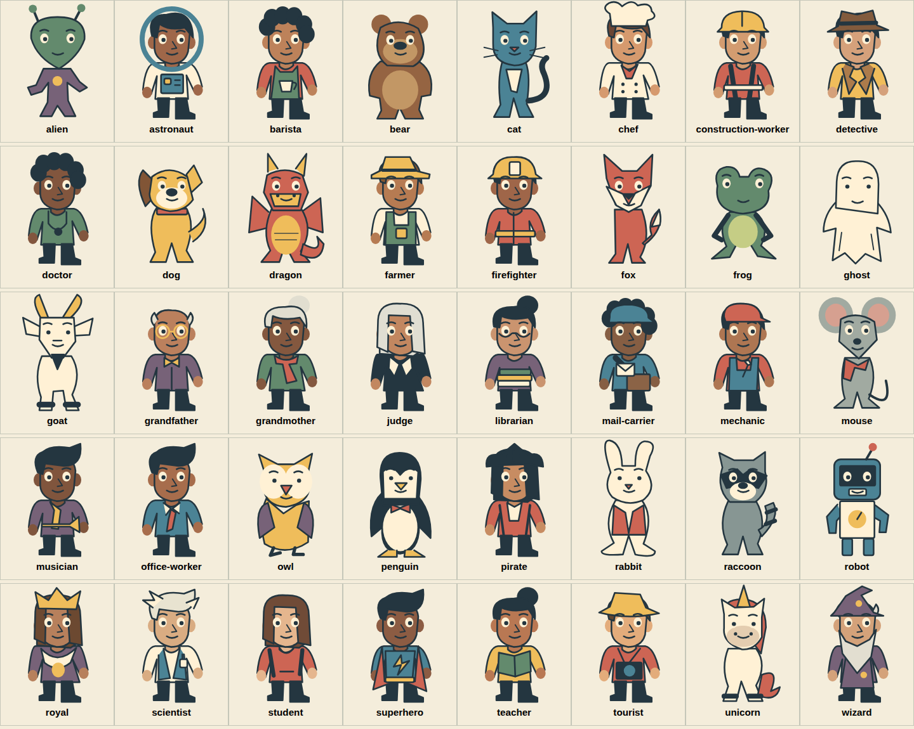
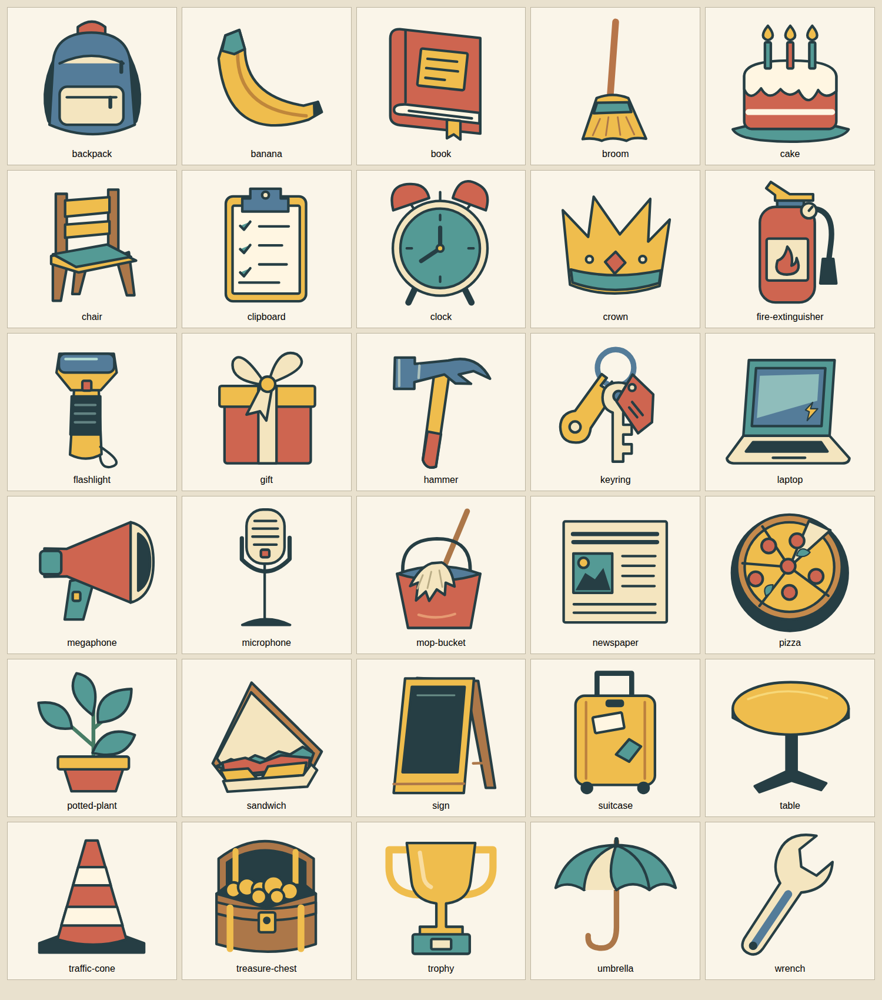
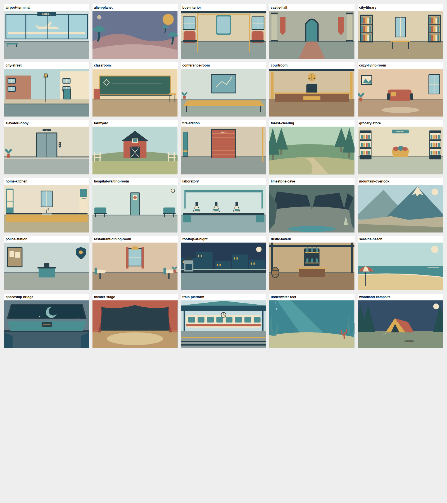

# Sandbox starter library

100 original GPT-6 Astra SVG assets: 40 characters, 30 settings, and 30 props. Every setting includes separately composed landscape and portrait artwork (130 SVG files total).

[Portrait settings contact sheet](previews/backgrounds-portrait.png)

Browse the linked Pouch entries below or search the installed runtime:

`node scripts/theater.mjs assets search --source local --query "teacher classroom book"`

Import a result with `assets add`, using its category and `starter-` ID. Original artwork and metadata are retained here; identical runtime copies live under src/sprites, src/backgrounds, and src/props. Characters include the facial animation groups and IDs. Upload receipts record byte-verified remote copies.

These assets may be reused and adapted in skits, and the resulting skits and editable projects may be shared. See ASSET-LICENSE.md for the scoped starter-library permission. Model attribution is GPT-6 Astra; no external generation API was used.

| Asset | Category | Search description |
| --- | --- | --- |
| [Curious alien visitor](https://pelicans.art/community.html?type=characters&id=curious-alien-visitor-3a1895) | characters | A green alien with a pear-shaped oversized head, long antennae and a compact plum jumpsuit. |
| [Optimistic astronaut](https://pelicans.art/community.html?type=characters&id=optimistic-astronaut-dad8f5) | characters | An astronaut in a cream spacesuit with a large round blue-edged clear helmet, chest panel and ochre gloves. |
| [Friendly barista](https://pelicans.art/community.html?type=characters&id=friendly-barista-92b3cf) | characters | A barista with short curls, coral shirt and a dark green apron with a large cream coffee cup emblem. |
| [Gentle lumbering bear](https://pelicans.art/community.html?type=characters&id=gentle-lumbering-bear-908175) | characters | A broad brown bear with small round ears, a cream muzzle and a large soft belly; a gentle giant. |
| [Sardonic house cat](https://pelicans.art/community.html?type=characters&id=sardonic-house-cat-3e740e) | characters | A slate-blue cat with triangular ears, long curling tail and a cream chest; poised to judge everyone. |
| [Busy chef](https://pelicans.art/community.html?type=characters&id=busy-chef-fc3ac6) | characters | A stout chef with a tall cloud-shaped white toque, double-breasted coat, red neckerchief and rolled sleeves. |
| [Resourceful builder](https://pelicans.art/community.html?type=characters&id=resourceful-builder-7e9a9c) | characters | A construction worker with an ochre hard hat, reflective orange vest and sturdy dark trousers. |
| [Suspicious detective](https://pelicans.art/community.html?type=characters&id=suspicious-detective-a14895) | characters | A detective with a tilted brown fedora and oversized ochre trench-coat lapels; useful for mysteries and interrogation. |
| [Thoughtful doctor](https://pelicans.art/community.html?type=characters&id=thoughtful-doctor-103295) | characters | A dark-skinned doctor in a sea-green coat, short curls, and a clearly visible stethoscope; useful for clinics and absurd diagnoses. |
| [Loyal scruffy dog](https://pelicans.art/community.html?type=characters&id=loyal-scruffy-dog-fdadb1) | characters | A sandy upright dog with one floppy dark ear, a cream muzzle, jaunty tail and a red collar. |
| [Small dramatic dragon](https://pelicans.art/community.html?type=characters&id=small-dramatic-dragon-1a03ab) | characters | A coral dragon with gold horns, small angular wings, a sweeping tail and a pale armored belly. |
| [Steady farmer](https://pelicans.art/community.html?type=characters&id=steady-farmer-f3d86b) | characters | A broad-shouldered farmer in a straw hat and green overalls with a cream work shirt. |
| [Resolute firefighter](https://pelicans.art/community.html?type=characters&id=resolute-firefighter-056137) | characters | A firefighter in an ochre helmet and red turnout coat with bright reflective bands; broad stance and reassuring expression. |
| [Smooth-talking fox](https://pelicans.art/community.html?type=characters&id=smooth-talking-fox-1373bc) | characters | An orange fox with enormous pointed ears, angular cream cheeks and a sweeping white-tipped tail. |
| [Confident pond frog](https://pelicans.art/community.html?type=characters&id=confident-pond-frog-0ad0b0) | characters | A green frog with wide-set raised eyes, a pale throat and very long splayed orange toes. |
| [Polite sheet ghost](https://pelicans.art/community.html?type=characters&id=polite-sheet-ghost-b02caa) | characters | A floating cream ghost with a scalloped trailing sheet and expressive dark eyes; friendly rather than frightening. |
| [Stubborn goat](https://pelicans.art/community.html?type=characters&id=stubborn-goat-6ec167) | characters | A cream goat with swept-back horns, angular ears, a pointed chin beard and dark split hooves. |
| [Dapper grandfather](https://pelicans.art/community.html?type=characters&id=dapper-grandfather-7f5638) | characters | An elderly man with wispy silver side hair, a plum waistcoat, bow tie and small gold reading spectacles. |
| [Spirited grandmother](https://pelicans.art/community.html?type=characters&id=spirited-grandmother-d2fc95) | characters | An elderly woman with a silver hair bun, green dress and bold coral scarf; an energetic family matriarch. |
| [Stern judge](https://pelicans.art/community.html?type=characters&id=stern-judge-8488d3) | characters | A silver-haired judge with a wide black robe, cream neck tabs and a deliberately unimpressed brow. |
| [Exacting librarian](https://pelicans.art/community.html?type=characters&id=exacting-librarian-374c5c) | characters | A librarian with a high dark bun, half-moon spectacles, plum cardigan and an orderly stack of books. |
| [Cheerful mail carrier](https://pelicans.art/community.html?type=characters&id=cheerful-mail-carrier-77b84f) | characters | A postal worker in a blue cap and uniform with a diagonal satchel strap and a cream envelope. |
| [Practical mechanic](https://pelicans.art/community.html?type=characters&id=practical-mechanic-7dee63) | characters | A mechanic with a red cap, blue overalls, rolled sleeves and a chunky wrench tucked into the bib pocket. |
| [Plucky little mouse](https://pelicans.art/community.html?type=characters&id=plucky-little-mouse-6d60b2) | characters | A tiny upright grey mouse with enormous pink-lined ears, thin tail and a red neckerchief. |
| [Cool jazz musician](https://pelicans.art/community.html?type=characters&id=cool-jazz-musician-6e2f55) | characters | A musician with swept-up hair, plum suit, mustard scarf and a stylized brass trumpet held across the torso. |
| [Overworked office worker](https://pelicans.art/community.html?type=characters&id=overworked-office-worker-8c83c6) | characters | A brown-skinned office worker with an untidy side part, rolled teal sleeves and a loosened red tie. |
| [Scholarly owl](https://pelicans.art/community.html?type=characters&id=scholarly-owl-83d7c3) | characters | A round ochre owl with dramatic cream facial discs, plum wings and small orange talons. |
| [Formal penguin](https://pelicans.art/community.html?type=characters&id=formal-penguin-c9c0ba) | characters | A black-and-cream penguin with flipper arms, ochre feet and a small red bow tie. |
| [Swaggering pirate](https://pelicans.art/community.html?type=characters&id=swaggering-pirate-db6066) | characters | A pirate captain with an asymmetric black tricorn, red coat and cream cravat; both eyes remain expressive for animation. |
| [Anxious rabbit](https://pelicans.art/community.html?type=characters&id=anxious-rabbit-9ce033) | characters | A cream rabbit with one bent long ear, oversized hind feet, coral waistcoat and a tiny pink nose. |
| [Resourceful raccoon](https://pelicans.art/community.html?type=characters&id=resourceful-raccoon-3584be) | characters | A grey raccoon with a dark face mask and a large striped tail; nimble paws suit secretive schemes. |
| [Helpful box robot](https://pelicans.art/community.html?type=characters&id=helpful-box-robot-f6156c) | characters | A teal-and-cream service robot with a square head, asymmetrical antenna, segmented limbs and a gold chest dial. |
| [Pompous monarch](https://pelicans.art/community.html?type=characters&id=pompous-monarch-d2d35f) | characters | A monarch with a large three-point crown, plum robe, cream collar and an oversized gold medallion. |
| [Excitable scientist](https://pelicans.art/community.html?type=characters&id=excitable-scientist-be6e70) | characters | An older scientist with white hair flaring sideways, teal shirt and a white laboratory coat with a pen pocket. |
| [Curious student](https://pelicans.art/community.html?type=characters&id=curious-student-3c7a4c) | characters | A young student with a rounded hair bob, coral hoodie, and bright mustard backpack straps. |
| [Earnest superhero](https://pelicans.art/community.html?type=characters&id=earnest-superhero-d73aa9) | characters | A superhero in a teal suit with a dramatic coral cape, ochre belt and a bold lightning chest emblem. |
| [Patient teacher](https://pelicans.art/community.html?type=characters&id=patient-teacher-4e503d) | characters | A warm brown-skinned teacher with a high hair bun, mustard cardigan and an open green lesson book; calm schoolroom authority. |
| [Delighted tourist](https://pelicans.art/community.html?type=characters&id=delighted-tourist-f41fa8) | characters | A tourist with a floppy sun hat, coral vacation shirt and a large camera hanging over the chest. |
| [Self-important unicorn](https://pelicans.art/community.html?type=characters&id=self-important-unicorn-a0e68e) | characters | A cream unicorn with a long gold horn, flowing coral mane, tiny hooves and a flamboyant tail. |
| [Distracted wizard](https://pelicans.art/community.html?type=characters&id=distracted-wizard-714a1c) | characters | A wizard wearing a tall bent plum hat and robe, with a flowing silver beard framing a visible animated mouth. |
| [Airport departure lounge](https://pelicans.art/community.html?type=backgrounds&id=airport-departure-lounge-87d5a0) | backgrounds | Broad terminal windows overlooking a parked plane silhouette, overhead gate sign and seating. |
| [Alien planet surface](https://pelicans.art/community.html?type=backgrounds&id=alien-planet-surface-966225) | backgrounds | Otherworldly mushroom plants frame a spacious dusty landscape beneath two moons. |
| [Inside a city bus](https://pelicans.art/community.html?type=backgrounds&id=inside-a-city-bus-1a8586) | backgrounds | A symmetrical aisle with paired seats, broad windows and yellow grab rails. |
| [Castle great hall](https://pelicans.art/community.html?type=backgrounds&id=castle-great-hall-5506c6) | backgrounds | Stone columns, hanging banners and an arched doorway surrounding a ceremonial carpet. |
| [Public library](https://pelicans.art/community.html?type=backgrounds&id=public-library-c01694) | backgrounds | Book-filled shelves flank a quiet reading table and tall window. |
| [Neighborhood street](https://pelicans.art/community.html?type=backgrounds&id=neighborhood-street-1b34f1) | backgrounds | A walkable city block with warm shopfronts and a streetlamp along the sidewalk. |
| [School classroom](https://pelicans.art/community.html?type=backgrounds&id=school-classroom-66b7e6) | backgrounds | Green chalkboard, geometric lesson and teacher desk with open floor for classroom scenes. |
| [Office conference room](https://pelicans.art/community.html?type=backgrounds&id=office-conference-room-83f99d) | backgrounds | Presentation screen and boardroom table in a calm modern office. Clear foreground for meetings, interviews and corporate comedy. |
| [Courtroom](https://pelicans.art/community.html?type=backgrounds&id=courtroom-2148aa) | backgrounds | Wooden judges bench under a scales emblem, with an open hearing floor. |
| [Cozy living room](https://pelicans.art/community.html?type=backgrounds&id=cozy-living-room-539e06) | backgrounds | Warm lounge with red sofa, framed landscape and large window; clear space in front for actors. |
| [Elevator lobby](https://pelicans.art/community.html?type=backgrounds&id=elevator-lobby-cdcc14) | backgrounds | Closed elevator doors with call buttons and a potted plant in a spare building lobby. |
| [Red barn farmyard](https://pelicans.art/community.html?type=backgrounds&id=red-barn-farmyard-ef80c0) | backgrounds | A red barn with cross-braced doors, fence sections and rolling fields. |
| [Fire station garage](https://pelicans.art/community.html?type=backgrounds&id=fire-station-garage-898cf7) | backgrounds | Red segmented engine bay door, brass pole and equipment locker; no vehicle embedded. |
| [Forest clearing](https://pelicans.art/community.html?type=backgrounds&id=forest-clearing-5a4b74) | backgrounds | Layered evergreen trees frame a sunlit woodland path and open clearing. |
| [Neighborhood grocery store](https://pelicans.art/community.html?type=backgrounds&id=neighborhood-grocery-store-12ea7f) | backgrounds | Two stocked shelving units and a produce display around a clear shopping aisle. |
| [Home kitchen](https://pelicans.art/community.html?type=backgrounds&id=home-kitchen-db2a57) | backgrounds | Domestic kitchen with cupboards, window, sink and an open floor for family or cooking scenes. |
| [Hospital waiting room](https://pelicans.art/community.html?type=backgrounds&id=hospital-waiting-room-65e653) | backgrounds | Quiet medical waiting area with paired benches, clock and marked treatment door. |
| [Research laboratory](https://pelicans.art/community.html?type=backgrounds&id=research-laboratory-8d110a) | backgrounds | A clean laboratory with glass flasks, a workbench and overhead pipework. |
| [Limestone cave](https://pelicans.art/community.html?type=backgrounds&id=limestone-cave-09d28d) | backgrounds | Deep rock chamber framed by stalactites and a shallow turquoise pool. |
| [Mountain overlook](https://pelicans.art/community.html?type=backgrounds&id=mountain-overlook-fd757a) | backgrounds | Snow-capped peaks behind a broad rocky overlook with space for hikers or adventurers. |
| [Police station reception](https://pelicans.art/community.html?type=backgrounds&id=police-station-reception-627da7) | backgrounds | Reception desk, investigation noticeboard and shield emblem for police procedural scenes. |
| [Restaurant dining room](https://pelicans.art/community.html?type=backgrounds&id=restaurant-dining-room-b7bf29) | backgrounds | An intimate restaurant with draped window, pendant light and small side tables. |
| [City rooftop at night](https://pelicans.art/community.html?type=backgrounds&id=city-rooftop-at-night-f5acca) | backgrounds | Moonlit skyline behind a rooftop parapet and a small stairwell entrance. |
| [Rustic tavern](https://pelicans.art/community.html?type=backgrounds&id=rustic-tavern-038c20) | backgrounds | Timber-beamed inn with bottle shelves, oak barrel and a substantial wooden bar. |
| [Sunny seaside beach](https://pelicans.art/community.html?type=backgrounds&id=sunny-seaside-beach-b74d72) | backgrounds | Gentle waves, a striped beach umbrella and a wide open stretch of sand. |
| [Spaceship bridge](https://pelicans.art/community.html?type=backgrounds&id=spaceship-bridge-797eff) | backgrounds | Angular observation windows, ring-lit planet and broad control console on a spacecraft bridge. |
| [Theater stage](https://pelicans.art/community.html?type=backgrounds&id=theater-stage-2831a8) | backgrounds | Red velvet curtains and a warm pool of stage light on wooden boards. |
| [Covered train platform](https://pelicans.art/community.html?type=backgrounds&id=covered-train-platform-7b4758) | backgrounds | A station canopy, clock, waiting train and layered rails for travel scenes. |
| [Underwater reef](https://pelicans.art/community.html?type=backgrounds&id=underwater-reef-b7bc74) | backgrounds | Sunbeams, seaweed and branching coral surround an open sandy seabed. |
| [Woodland campsite at dusk](https://pelicans.art/community.html?type=backgrounds&id=woodland-campsite-at-dusk-24b890) | backgrounds | Canvas tent and evergreen silhouettes under moonlight, with open campsite foreground. |
| [Everyday backpack](https://pelicans.art/community.html?type=props&id=everyday-backpack-2659cb) | props | A slouchy blue backpack with a cream front pocket, red zipper pulls and an arched carrying loop. |
| [Perfectly suspicious banana](https://pelicans.art/community.html?type=props&id=perfectly-suspicious-banana-3d433f) | props | A sweeping yellow banana with a curled tip, green stem and broad inner ridge. A simple readable comedy or kitchen prop. |
| [Well-loved hardback](https://pelicans.art/community.html?type=props&id=well-loved-hardback-7b21d1) | props | A chunky red hardback book with a cloth spine, cream page block and a gold bookmark peeking below. |
| [Straw broom](https://pelicans.art/community.html?type=props&id=straw-broom-9a2ed4) | props | A wide bristled straw broom with a tall red handle, teal binding and an uneven working edge. |
| [Celebration cake](https://pelicans.art/community.html?type=props&id=celebration-cake-05ae07) | props | A two-layer strawberry cake with dripping cream icing, three candles and a broad serving plate. |
| [Wooden kitchen chair](https://pelicans.art/community.html?type=props&id=wooden-kitchen-chair-cf6992) | props | A warm wooden chair in three-quarter view with a teal cushion, open back slats and four clearly separated legs. |
| [Inspection clipboard](https://pelicans.art/community.html?type=props&id=inspection-clipboard-4ea11a) | props | A honey-colored clipboard with an oversized metal clip and three bold checklist ticks. Useful for officials, doctors and very serious inspections. |
| [Alarm clock](https://pelicans.art/community.html?type=props&id=alarm-clock-cfc588) | props | A cream twin-bell alarm clock with red bells, clearly visible dark hands and a teal round face. |
| [Slightly crooked crown](https://pelicans.art/community.html?type=props&id=slightly-crooked-crown-2c6862) | props | A theatrical gold crown with five broad points, a red central gem and a deep teal inset band. |
| [Fire extinguisher](https://pelicans.art/community.html?type=props&id=fire-extinguisher-0b0234) | props | A red fire extinguisher with a black hose, pressure gauge and a bold flame symbol on its cream label. |
| [Yellow inspection flashlight](https://pelicans.art/community.html?type=props&id=yellow-inspection-flashlight-e18fb9) | props | A sturdy yellow flashlight with an oversized blue lens, rubber grip and hanging wrist loop. |
| [Big ribbon gift](https://pelicans.art/community.html?type=props&id=big-ribbon-gift-bf7ad9) | props | A coral present with a wide cream ribbon and exuberant asymmetrical bow, suitable for birthdays or suspicious deliveries. |
| [Carpenter hammer](https://pelicans.art/community.html?type=props&id=carpenter-hammer-2da51e) | props | A heavy steel claw hammer with a long amber handle and a red grip. The split claw and flat striking head read clearly. |
| [Caretaker keyring](https://pelicans.art/community.html?type=props&id=caretaker-keyring-e18cd1) | props | A large blue keyring holding two distinct metal keys and a coral identification tag. Useful for doors, hotels, caretakers and a missing-key reveal. |
| [Stickered laptop](https://pelicans.art/community.html?type=props&id=stickered-laptop-ac8f7b) | props | An open teal laptop with a bright blank screen, chunky keyboard and a little lightning sticker. The screen is clear enough for a scene overlay. |
| [Red rally megaphone](https://pelicans.art/community.html?type=props&id=red-rally-megaphone-5cd7b5) | props | A bright red cone megaphone with a cream horn rim, hand grip and a visible talk button. |
| [Stand microphone](https://pelicans.art/community.html?type=props&id=stand-microphone-981c6e) | props | A silver vintage stage microphone on a tall dark stand, with a red on-air switch and broad stable foot. |
| [Mop and bucket](https://pelicans.art/community.html?type=props&id=mop-and-bucket-b78205) | props | A coral cleaning bucket with a looping handle and a leaning mop whose broad cream strands hang over the rim. |
| [Folded newspaper](https://pelicans.art/community.html?type=props&id=folded-newspaper-d3ef17) | props | A broad folded cream newspaper with a dramatic headline block, a framed photo and clean column shapes. No real publication or story is named. |
| [Pizza on a tray](https://pelicans.art/community.html?type=props&id=pizza-on-a-tray-72ae82) | props | A generous round pizza on a dark serving tray, with six red pepperoni rounds, basil leaves and one slightly shifted slice. |
| [Resilient houseplant](https://pelicans.art/community.html?type=props&id=resilient-houseplant-28c8e0) | props | A cheerful broad-leaf houseplant with an asymmetrical branching silhouette and a terracotta pot. Leaves have generous gaps for clear stage readability. |
| [Lunch sandwich](https://pelicans.art/community.html?type=props&id=lunch-sandwich-069f72) | props | A tall triangular sandwich showing crisp lettuce, tomato and cheese between two generous slices of bread. |
| [Blank sandwich-board sign](https://pelicans.art/community.html?type=props&id=blank-sandwich-board-sign-15b37a) | props | A freestanding chalkboard sandwich sign with a warm wood frame and a deliberately empty dark writing surface. Add scene-specific text over the board. |
| [Travel suitcase](https://pelicans.art/community.html?type=props&id=travel-suitcase-bfc241) | props | An upright mustard rolling suitcase with an extended handle, two wheels and bold contrasting travel labels. |
| [Round cafe table](https://pelicans.art/community.html?type=props&id=round-cafe-table-804649) | props | A compact round cafe table with a honey-colored top and a dark branching pedestal, leaving room for actors on both sides. |
| [Traffic cone](https://pelicans.art/community.html?type=props&id=traffic-cone-184cdf) | props | A sturdy orange road cone with two broad cream reflective stripes and a wide dark weighted base. |
| [Pirate treasure chest](https://pelicans.art/community.html?type=props&id=pirate-treasure-chest-a73318) | props | An open wooden treasure chest with an arched lid, brass bands and a mound of oversized gold coins. |
| [First-place trophy](https://pelicans.art/community.html?type=props&id=first-place-trophy-df0b1b) | props | A large gold cup with proud curling handles, a narrow stem and a solid teal prize plinth. |
| [Storm umbrella](https://pelicans.art/community.html?type=props&id=storm-umbrella-cb12b9) | props | An open teal umbrella with alternating cream panels, a curved wooden handle and scalloped rain canopy. |
| [Workshop wrench](https://pelicans.art/community.html?type=props&id=workshop-wrench-59aa61) | props | A broad steel open-end wrench with a blue handle inset and unmistakable crescent jaw. |
